# 专题9 带电粒子在电场中的运动1 · 上课稿

## 〇、备课提示（教师自用，不板书）

**本专题五个板块，对应五类模型：**

| 板块 | 题号 | 核心工具 |
|---|---|---|
| 一、电场中的平衡问题 | 1、2 | 三力平衡 + 正交分解；'E = F/q' 定义式 |
| 二、匀变速直线运动 | 3、4、5 | 合力恒定 + 初速度方向 → 判直线/曲线；动能定理 |
| 三、类抛体运动 | 6、7、8 | 加速—偏转模型两个常用结论 |
| 四、圆周运动 | 9、10 | 等效重力法；等效最高点 ≠ 几何最高点 |
| 五、功能关系 | 11 | 垂直电场方向速度分量守恒 |

**本节课要反复强调的三条主线：**

1. **库仑定律只对点电荷成立。** 圆环、棒、板这类有尺寸的带电体，一律绕道走——用平衡条件反推力，再用 'E = F/q'。
2. **恒力 + 初速度决定轨迹。** 初速度为零 → 一定是直线；初速度与合力不共线 → 一定是曲线，且轨迹夹在两个方向之间。
3. **谁做功管谁。** 合力做功管动能，电场力做功管电势能，除重力外的力做功管机械能。三句话贴在黑板角上，整节课不擦。

**课堂节奏建议：** 第 1、6、9 三题是"讲透题"，各留 10 分钟完整推演；其余题目采用"学生先判 → 教师点破陷阱"的快节奏，每题 3—5 分钟。

---

## 一、电场中的平衡问题

### 【导入语】

同学们，静电场这一章我们已经学完了概念和定律，从今天开始进入"运动"。但在讲运动之前，先用两道平衡题热身——因为**平衡是运动的特例**，而且这两道题里藏着整章最经典的两个陷阱。

---

### 第 1 题 · 带电圆环旁的平衡小球

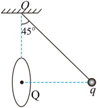

**题目**

如图所示，'O' 点正下方固定一带电量为 'Q' 的金属环。质量为 'm'、带电量为 'q' 的小球用绝缘细线悬挂于 'O' 点，小球平衡时与环中心等高，细线与竖直方向夹角为 '45°'。已知细线长为 'L'，重力加速度为 'g'，静电力常量为 'k'。则（　　）

A. 细线拉力大小为 'mg'

B. 细线拉力大小为 '2√2·kQq / L²'

C. 小球受静电力大小为 '2kQq / L²'

D. 金属环在小球处产生电场的电场强度大小为 'mg / q'

**答案：D**

---

#### 【讲解设计】

**提问引入：** "看到 'Q'、看到距离，第一反应想干什么？"——学生大概率会答"用库仑定律"。这正是本题要打掉的条件反射。先不否定，让他们算下去，算到 C 选项时再回头收网。

**第一步：受力分析——先数清楚几个力。**（板书受力图）

小球受三个力：

- 重力 'mg'，竖直向下；
- 细线拉力 'F'，沿细线指向 'O' 点，与竖直方向成 '45°'；
- 金属环的静电力 'F库'。

> **重点讲这一句：** 为什么静电力是水平的？因为小球与环中心**等高**，环上关于水平面对称的电荷，对小球作用力的竖直分量两两抵消，只剩水平分量。设为水平向右（背离环心）。
>
> 这是对称性的运用，比硬算积分省事得多。让学生自己在图上画一对对称电荷验证一下。

**第二步：平衡条件解出两个力。**

拉力沿竖直、水平分解：

'F·cos45° = mg'，'F·sin45° = F库'

解得：

'F = √2·mg'，'F库 = mg'

**到这里 A 就死了**——拉力是 '√2·mg'，不是 'mg'。

> 提醒学生：这一步没有用到 'Q'、'k'、'L' 中的任何一个。平衡问题的力，往往靠平衡条件本身就能全部解出来，不需要力的来源信息。

**第三步：故意跳进陷阱。**（这一步一定要演给学生看）

细线长 'L'、与竖直方向成 '45°'，所以小球相对 'O' 点：

- 水平偏移 'L·sin45° = (√2/2)L'
- 竖直下降 'L·cos45° = (√2/2)L'

环心在 'O' 正下方且与小球等高，所以环心到小球的水平距离：

'd = (√2/2)L'

**如果硬套库仑定律：**

'kQq / d² = 2kQq / L²' ← 正好是选项 C

'拉力 = √2 × 2kQq/L² = 2√2·kQq/L²' ← 正好是选项 B

**板书写大字：这就是命题人给你挖的坑，而且挖得很精致——两个选项都算得出来。**

**第四步：识破陷阱。**

库仑定律的适用条件是**点电荷**。金属环的电荷分布在整个环上，环的尺寸与距离 'd' 是同一量级，**不能**看作集中在环心的点电荷。所以：

'F库 ≠ 2kQq / L²'

**B、C 全错。**

**第五步：用定义式绕开。**

'E = F/q' 是**定义式**，对任何电场都成立，不需要点电荷假设。第二步已经求出 'F库 = mg'，所以：

'E = F库/q = mg/q'

**D 正确。故选 D。**

---

#### 【板书要点】

> **易错点：** 看到"带电量为 'Q'、距离为 'd'"就条件反射写 'kQq/d²'。
>
> 凡是题目中出现**带电圆环、带电棒、带电板**这类有尺寸的带电体，库仑定律一律不能直接用。正确路线：
>
> **平衡条件 → 反推出力 → 用 'E = F/q' 求场强。**

#### 【课堂追问】

"如果题目把金属环换成一个点电荷 'Q' 放在环心位置，哪些选项会变对？"——答案是 B、C、D 都对了。用这个反问，让学生明确"有尺寸"这三个字的分量。

---

### 第 2 题 · 两球悬挂 + 匀强电场

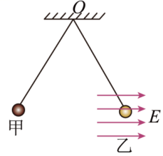

**题目**

如图所示，带电荷量均为 'q'（'q > 0'）的小球甲、乙（视为质点）分别用绝缘的轻质细线悬挂在 'O' 点，其中乙处在水平向右、电场强度大小为 'E' 的匀强电场中，静止时甲、乙处在同一水平高度且间距为 'L'，两细线与竖直方向的夹角均为 '30°'。已知静电力常量为 'k'，重力加速度为 'g'，则乙与甲的质量之差为（　　）

A. '√3·Eq / g'

B. '√3·Eq / (3g)'

C. '(√3·q/g)·(E − kq/L²)'

D. '(√3·q/g)·(E + kq/L²)'

**答案：A**

---

#### 【讲解设计】

**开场提问：** "题目给了 'k' 和 'L'，是不是一定要用上？"——大部分学生会说"给了就得用"。这题就是治这个毛病的。

**第一步：分别受力分析。**（板书两个受力图，并排画）

**甲**（在左，质量 'm₁'）受：

- 重力 'm₁g'
- 乙对它的库仑斥力 'F₁'（同号电荷相斥，水平向左）
- 细线拉力 'T₁'

> **强调：甲不在电场区域内**，不受匀强电场的力。这是题目埋的细节，读题时必须圈出来。

**乙**（在右，质量 'm₂'）受：

- 重力 'm₂g'
- 甲对它的库仑斥力 'F₂'（水平向右）
- 匀强电场的电场力 'qE'（水平向右）
- 细线拉力 'T₂'

**第二步：对甲列平衡方程。**

两球等高、都挂在 'O' 点，所以两根线与竖直方向夹角都是 '30°'。分解拉力：

'T₁·sin30° = F₁'，'T₁·cos30° = m₁g'

两式相除，消掉 'T₁'：

'F₁ / (m₁g) = tan30°'

> **方法提示：** 悬线问题一律"两式相除"消拉力。拉力通常是我们不关心的量，除法是最快的消元手段。

**第三步：对乙列平衡方程。**

乙受的两个水平力**方向相同**，合并成一个水平力 'F₂ + qE'：

'(F₂ + qE) / (m₂g) = tan30°'

**第四步：牛顿第三定律搭桥。**

'F₁' 和 'F₂' 是一对作用力与反作用力，'F₁ = F₂ = F'。于是：

'F = m₁g·tan30°'

'F + qE = m₂g·tan30°'

两式相减：

'qE = (m₂ − m₁)·g·tan30°'

**第五步：解出质量差。**

'm₂ − m₁ = qE / (g·tan30°) = qE / (g·√3/3) = √3·Eq / g'

**故选 A。**

---

#### 【板书要点】

> **关键点：'k' 和 'L' 都是多余条件。** 库仑力 'F' 在两式相减时被整个消掉了，根本不需要知道它的具体大小。
>
> 选项 C、D 就是给"非要把 'kq²/L²' 代进去"的同学准备的。
>
> **看到题目给了用不上的量，不要慌——先按平衡条件老老实实列式，能消就消。**

#### 【课堂追问】

"两根线与竖直方向夹角相等，说明了什么？"——说明 'F/(mg)' 对两球相同，这是整道题能相减的前提。让学生意识到"角度相等"是一个隐藏的等式条件。

---

## 二、电场中的匀变速直线运动问题

### 【过渡语】

平衡题讲完了。现在把"合力为零"改成"合力不为零但恒定"，就进入了本专题的第二块。这一块只需要回答一个问题：**恒力作用下，物体走直线还是走曲线？**

**板书判据（整节课不擦）：**

> - 初速度 = 0，合力恒定 → **一定是直线**（沿合力方向匀加速）
> - 初速度 ≠ 0，且与合力**共线** → 直线（匀加速或匀减速）
> - 初速度 ≠ 0，且与合力**不共线** → **一定是曲线**，轨迹夹在初速度方向与合力方向之间

---

### 第 3 题 · 45° 斜向电场中的四种运动

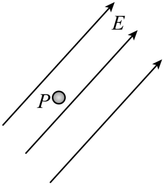

**题目**

如图所示，空间中存在与水平方向成 '45°' 角斜向右上方的匀强电场，电场强度为 'E'，在电场中的 'P' 点有一个质量为 'm'、电荷量为 'q' 的带正电的小球。已知电场强度 'E = √2·mg / q'，其中 'g' 为重力加速度，忽略空气阻力，下列对小球运动情况分析正确的是（　　）

A. 若小球从静止释放，小球将做曲线运动

B. 若小球以某一速度竖直向下抛出，小球的动能一直增加

C. 若小球以某一速度竖直向上抛出，小球电势能先减小后增大

D. 若小球初速度方向与电场线方向相同，最终小球可能竖直向下做直线运动

**答案：B**

---

#### 【讲解设计】

**开场：** "四个选项，四种抛法。要不要一个一个算？——不用。先把合力求出来，这道题就废了一大半。"

**第一步：求合力——全题的钥匙。**

小球带正电，电场力与电场同向，即与水平成 '45°' 斜向右上，大小：

'F = qE = q · (√2·mg/q) = √2·mg'

分解：

- 竖直分量：'Fy = F·sin45° = √2·mg × (√2/2) = mg'（向上）
- 水平分量：'Fx = F·cos45° = mg'（向右）

**第二步：竖直方向恰好抵消。**

'Fy = mg'，正好与重力平衡，所以：

'F合 = Fx = mg，方向水平向右，大小恒定'

**板书写大字：这道题从此变成一道"只有水平方向恒力"的题。**

> **教学提醒：** 让学生把重力和电场力的竖直分量在图上用两个箭头对消掉，只留一个水平向右的箭头。视觉上的简化能极大降低后面四个选项的判断难度。

**第三步：逐项判断。**

**A（错）** 从静止释放，初速度为零，合力恒定 → 沿合力方向做**匀加速直线运动**（水平向右）。不是曲线。

依据就是黑板上的判据第一条。

**B（对）** 竖直向下抛出，合力水平向右，与初速度垂直 → **类平抛运动**。

- 水平方向：从零开始向右加速，水平位移向右，与合力同向；
- 竖直方向：重力与电场力竖直分量抵消，不做净功。

所以合力做的总功：

'W合 = F合 · x > 0'

一直为正。由动能定理 'W合 = ΔEk'，**动能一直增加**。

**C（错）** 竖直向上抛出。

> **这一问是本题的分水岭，一定要点破：** 要看的是**电场力做功**（决定电势能），不是合力做功。学生最容易在这里把两者混为一谈。

电场力方向为右上 '45°'，小球的位移是"竖直向上 + 水平向右"，这个位移在电场力方向上的投影**始终为正**，所以电场力一直做正功，电势能**一直减小**，不存在"先减小后增大"。

**D（错）** 初速度方向与电场线相同（右上 '45°'），而合力方向水平向右，两者**不共线** → 匀变速曲线运动，轨迹夹在初速度方向与合力方向之间，永远不可能变成竖直向下的直线。

**故选 B。**

---

#### 【板书要点】

> **三句话，贴在黑板角上，本专题反复用：**
>
> - **合力做功 → 管动能**
> - **电场力做功 → 管电势能**
> - **除重力外的力做功 → 管机械能**
>
> 别混用。C 选项错就错在拿"合力"去判"电势能"。

---

### 第 4 题 · 静电场分选

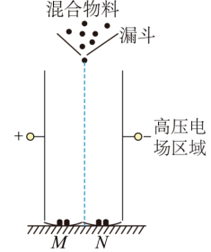

**题目**

静电场分选是在高压电场中利用入选物料的电性差异进行分选的方法。如图，从漏斗漏出的混合物料经起电区（未画出）起电（带正电或负电）后沿电场中线由静止进入高压电场，物料全部落入地面上 'M'、'N' 槽中且打不到极板。已知物料颗粒（可视为质点）的质量均为 'm'、电荷量大小均为 'q'，漏斗底部距槽的高度为 'h'，高压电场区域可视为匀强电场，电场强度大小为 'E'，不计空气阻力和物料间的相互作用力，忽略槽的高度，重力加速度大小为 'g'，则起电后的物料经过高压电场区域时（　　）

A. 一定做曲线运动

B. 电势能可能增大

C. 极板间距一定大于 '2qEh / (mg)'

D. 机械能增大 '(m²g² + q²E²)h / (mg)'

**答案：C**

---

#### 【讲解设计】

**开场：** 这是一道**情境题**，读题时先把工程背景剥掉，问自己："物理上就是一个什么模型？"——一个从静止开始、同时受重力和水平恒力的质点。

**第一步：受力与运动性质。**

物料受重力 'mg'（竖直向下）和电场力 'qE'（水平，带正电向一侧、带负电向另一侧）。两个力都是恒力 → 合力恒定；物料**由静止**进入 → 初速度为零。

初速度为零 + 合力恒定 ⇒ 沿合力方向做**匀加速直线运动**（一条斜向下的直线）。**A 错。**

> 学生的直觉常常是"两个方向都有运动 = 曲线"。要强调：曲线的判据是**初速度与合力不共线**，而不是"有两个方向的分运动"。

**第二步：电势能怎么变。**

不管带正电还是负电，电场力方向总是指向某一块极板，而物料在这个方向上确实产生了位移，所以电场力**一定做正功**。由 'W电 = −ΔEp' 得电势能**一定减小**，不可能增大。**B 错。**

**第三步：算水平偏移量（本题计算核心）。**

竖直方向：只有重力，自由落体，全程下落高度 'h'

'h = ½·g·t²'  ⟹  't² = 2h/g'

水平方向：加速度 'a = qE/m'，初速度为零

'x = ½·a·t² = ½ · (qE/m) · (2h/g) = qEh / (mg)'

**第四步：由"打不到极板"推极板间距。**

> **在图上标出中线，让学生自己看。** 这一步的错误率最高。

物料从**中线**出发，只要偏移量小于半个板间距就打不到极板：

'd/2 > x'  ⟹  'd > 2x = 2qEh / (mg)'

**C 正确。**

> **易错提示：** 最容易错的是漏掉"从中线进入"这个条件，直接写成 'd > x'。读题时"沿电场中线由静止进入"这九个字必须画线。

**第五步：算机械能增量。**

除重力外只有电场力做功，所以机械能的变化量等于电场力做的功：

'ΔE = W电 = qE·x = qE · qEh/(mg) = q²E²h / (mg)'

机械能确实**增大**了，但增量是 'q²E²h/(mg)'，不是选项给的 '(m²g² + q²E²)h/(mg)'。

**拆开选项 D 看看它多算了什么：**

'(m²g² + q²E²)h/(mg) = m²g²h/(mg) + q²E²h/(mg) = mgh + q²E²h/(mg)'

多出来的 'mgh' 正是**重力做的功**。而重力做功只是在机械能内部把重力势能转成动能，**不改变机械能总量**。**D 错。**

**故选 C。**

---

#### 【板书要点】

> 选项 D 的设计非常典型：把"合力做的功"当成了"机械能的增量"。
>
> **记牢：ΔE机械 = W（除重力外的力）。重力做功永远不出现在这个式子里。**

---

### 第 5 题 · 斜面上的图像判断

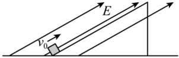

**题目**

一个光滑绝缘的斜面固定在水平面上，并处于沿平行于斜面向上的匀强电场中，一个带 '+q' 的物块以初速度 'v₀' 从斜面底端冲上斜面，上滑位移 'x₀' 时速度恰好为零。取斜面底端所在处的高度和电势均为零，下列描述物块的机械能 'E机'、电场力功率 'P'、电势能 'Ep电'、动能 'Ek' 随时间 't' 或位移 'x' 变化的图像中，正确的是（　　）

| A | B |
|---|---|
| 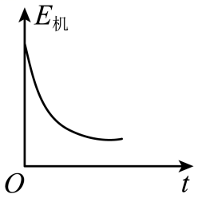 | 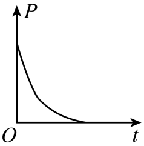 |

| C | D |
|---|---|
| 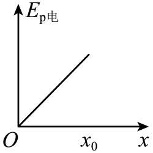 | 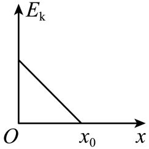 |

**答案：D**

---

#### 【讲解设计】

**开场：** 图像题不要盯着图猜趋势。**通用套路是：先写函数表达式，再看它是几次函数，最后看斜率正负。** 三步走，一步都不能省。

**第一步：先定性判断受力和运动。**

物块沿斜面向上运动，受：

- 重力沿斜面向下的分量 'mg·sinθ'
- 电场力 'qE'，沿斜面**向上**
- 斜面支持力（不做功，斜面光滑无摩擦）

物块在减速（'v₀' 减到 '0'），说明沿斜面向下的合力占优：

'mg·sinθ > qE'

> **把这个不等式框起来**，判断 D 时要用。这是从"减速"这个现象反推出来的隐含条件，学生常常读不出来。

**第二步：判断 A（机械能–时间）。**

除重力外，只有电场力做功。电场力沿斜面向上，位移也沿斜面向上，所以**电场力做正功**：

'ΔE机 = W电 > 0'

机械能应该**增加**。而 A 图画的是递减。**A 错。**

**第三步：判断 B（电场力功率–时间）。**

瞬时功率：

'P = F·v = qE·v = qE·(v₀ − at)'

其中 'a' 恒定 ⟹ 'v' 是 't' 的**一次函数** ⟹ 'P' 也是 't' 的一次函数 → 'P–t' 图应该是一条**斜向下的直线**。B 图画成曲线。**B 错。**

**第四步：判断 C（电势能–位移）。**

电场力做正功 ⟹ 电势能**减小**。C 图画成递增。**C 错。**

**第五步：判断 D（动能–位移）。**

从起点算到位移 'x' 处，用动能定理：

'Ek − Ek₀ = (qE − mg·sinθ)·x'

即：

'Ek = Ek₀ + (qE − mg·sinθ)·x'

由第一步框起来的不等式，'qE − mg·sinθ < 0'，所以这是一条**斜率为负的直线**，从 'Ek₀ = ½·m·v₀²' 出发，在 'x = x₀' 处降到零。**D 正确。**

**故选 D。**

---

#### 【板书要点】

> **图像题通用三步法：**
>
> 1. 写出物理量随自变量的**函数表达式**
> 2. 看它是一次函数（**直线**）还是二次/其他（**曲线**）
> 3. 看**斜率正负**
>
> 不要凭感觉画趋势。本题 B 选项就是专门骗"凭感觉"的。

---

## 三、电场中的类抛体运动

### 【过渡语】

这是本专题最重要的一块，也是高考的常客。核心模型只有一个：**先加速，后偏转**。今天把两个结论推出来，后面所有同类题都是套用。

---

### 第 6 题 · 加速—偏转标准模型【重点讲透】

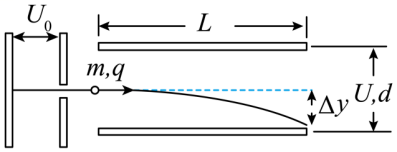

**题目**

如图所示，一个正电荷由静止开始经加速电场加速后，沿平行于板面的方向射入偏转电场，并从另一侧射出。已知电荷质量为 'm'，电荷量为 'q'，加速电场电压为 'U₀'。偏转电场可看做匀强电场，极板间电压为 'U'，极板长度为 'L'，板间距为 'd'。不计正电荷所受重力，下列说法正确的是（　　）

A. 正电荷从加速电场射出时具有的速度 'v₀ = √(2qU/m)'

B. 正电荷从偏转电场射出时具有的动能 'Ek = qU₀ + qU'

C. 正电荷从偏转电场射出时速度与水平方向夹角的正切值 'tanα = UL / (2U₀d)'

D. 正电荷从偏转电场射出时沿垂直板面方向的偏转距离 'y = L² / (4d)'

**答案：C**

---

#### 【讲解设计】

**开场：** "这道题不要按选项走，按**模型**走。我们先把四个基本量推一遍，推完了回头看，四个选项自动分好对错。"

板书四个待推量：'v₀'、'y'、'tanα'、'Ek'。

**第一步：加速阶段——动能定理。**

加速电场对电荷做功 'qU₀'，电荷由静止加速到 'v₀'：

'qU₀ = ½·m·v₀²'  ⟹  'v₀ = √(2qU₀/m)'

> **注意用的是加速电压 'U₀'，不是偏转电压 'U'。** 选项 A 写成 '√(2qU/m)'，把两个电压张冠李戴了。**A 错。**
>
> 这个"换字母"的坑在考试中出现频率极高，读选项时要逐个字母核对。

**第二步：偏转阶段——分解成类平抛。**

沿板方向（设为水平）：**匀速**

'L = v₀·t'  ⟹  't = L / v₀'

垂直板方向：**匀加速**，加速度

'a = qE/m = qU/(md)'

（这里用了 'E = U/d'，匀强电场中场强与电压的关系。）

**第三步：算偏转距离 'y'。**

'y = ½·a·t² = ½ · qU/(md) · (L/v₀)² = qUL² / (2md·v₀²)'

把 'v₀² = 2qU₀/m' 代入：

'y = qUL²/(2md) · m/(2qU₀) = UL² / (4U₀d)'

> **停下来强调：'q' 和 'm' 全部约掉了。** 这个现象在第 7 题会成为整道题的题眼，这里先埋个伏笔。

选项 D 给的是 'L²/(4d)'，把 'U/U₀' 丢了——**量纲都不对**。**D 错。**

> 教学技巧：让学生养成"看量纲"的习惯。'L²/(4d)' 的量纲是长度，看似没问题，但它不含任何电学量，意味着"不加电压也会偏转"，物理上荒谬。

**第四步：算出射角正切。**

'vy = a·t = qU/(md) · L/v₀'

'tanα = vy/v₀ = qUL/(md·v₀²) = qUL/(md) · m/(2qU₀) = UL / (2U₀d)'

**C 正确。**

**第五步：算出射动能。**

全程用动能定理。加速电场做功 'qU₀'，偏转电场做功 'qE·y = q(U/d)·y'：

'Ek = qU₀ + q(U/d) · UL²/(4U₀d) = qU₀ + qU²L² / (4U₀d²)'

选项 B 写成 'qU₀ + qU'，等于默认电荷在偏转电场里**走完了整个板间距 'd'**，但实际只偏移了 'y < d/2'。**B 错。**

**故选 C。**

---

#### 【板书要点 —— 必背结论，抄在笔记本首页】

> **加速—偏转模型两大结论：**
>
> 'y = UL² / (4U₀d)'
>
> 'tanα = UL / (2U₀d)'
>
> **并且有：'tanα = 2y / L'**
>
> 几何含义：**出射方向的反向延长线，交于极板的中点。** 画图时这条线一定从板长中点射出。

#### 【课堂追问】

"为什么反向延长线过中点？"——因为类平抛中平均速度对应的位移是末速度方向的一半。让学有余力的学生自己证：'tanα = 2y/L' 直接等价于"延长线交于 'L/2' 处"。

---

### 第 7 题 · 四种原子核打在同一点

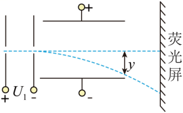

**题目**

如图，氕（¹₁H）、氘（²₁H）、氚（³₁H）和氦（⁴₂He）的原子核由静止开始经同一加速电场 'U₁' 加速后，又经同一匀强电场偏转，最后打在荧光屏上。下列说法正确的是（　　）

A. 四种原子核飞出加速电场时的速度相同

B. 四种原子核在偏转电场中的偏转距离不同

C. 四种原子核飞出偏转电场时的动能相同

D. 四种原子核打在荧光屏的同一位置上

**答案：D**

---

#### 【讲解设计】

**开场：** "上一题最后我说'q 和 m 全约掉了'，现在这道题就来考这件事。"

**第零步：先列表——把四种核的参数摆清楚。**（板书表格）

| 核 | 电荷量 'q' | 质量 'm' | 比荷 'q/m' |
|---|---|---|---|
| 氕 ¹₁H | 'e' | '1u' | 'e/u' |
| 氘 ²₁H | 'e' | '2u' | 'e/(2u)' |
| 氚 ³₁H | 'e' | '3u' | 'e/(3u)' |
| 氦 ⁴₂He | '2e' | '4u' | 'e/(2u)' |

**结论：四者比荷不全相同，电荷量也不全相同。**

> 这一步花 2 分钟一定值得。核素符号左下角是**质子数（电荷数）**，左上角是**质量数**。写不出这张表，后面全是瞎猜。

**第一步：判断 A（加速后的速度）。**

'qU₁ = ½·m·v₁²'  ⟹  'v₁ = √(2qU₁/m) = √(2U₁ · q/m)'

速度**只由比荷决定**。氕的比荷是氘的两倍，速度不同。**A 错。**

**第二步：判断 B（偏转距离）。**

设偏转电场电压 'U₂'、板长 'L₁'、板间距 'd'。直接套第 6 题的结论：

'y = U₂·L₁² / (4U₁·d)'

**这个式子里没有 'q'，也没有 'm'。**

> 解释为什么：推导中 'q/m' 出现两次——一次在偏转加速度 'a = qU₂/(md)' 里（分子），一次在 'v₀² = 2qU₁/m' 里（分母），正好约掉。
>
> **让学生自己在草稿纸上把这个约分过程再写一遍。** 这是本题真正的知识点。

所以四种核的偏转距离 'y' **完全相同**。**B 错。**

**第三步：判断 C（出射动能）。**

全程动能定理：

'Ek = qU₁ + q(U₂/d)·y'

'U₁'、'U₂'、'y' 对四者都一样，所以 'Ek ∝ q'。氦核电荷量是其余三个的 2 倍，动能就是它们的 2 倍。**C 错。**

**第四步：判断 D（打在屏上的位置）。**

设偏转极板右端到荧光屏的水平距离为 'L₂'，出射偏转角为 'θ'，则打在屏上的竖直距离：

'Y = y + L₂·tanθ'

由第 6 题的结论 'tanθ = 2y/L₁'，代入：

'Y = y + 2y·L₂/L₁ = y·(1 + 2L₂/L₁)'

'Y' **只取决于 'y'**，而第二步已证明 'y' 与 'q'、'm' 无关，所以四种核打在**同一位置**。**D 正确。**

**故选 D。**

---

#### 【板书要点 —— 值得背下来】

> **同一加速电场 + 同一偏转电场，所有带电粒子打在屏上的位置都相同，与电荷量、质量都无关。**
>
> 原因：'y = U₂L₁²/(4U₁d)' 里根本没有粒子的参数。
>
> **但动能不同**（'Ek ∝ q'），**速度也不同**（'v ∝ √(q/m)'）。位置相同 ≠ 什么都相同，别推广过头。

---

### 第 8 题 · 轨迹图 + 能量转化

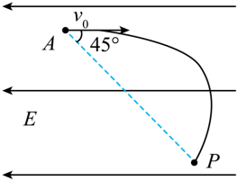

**题目**

一带正电小球自 'A' 点水平向右射入水平向左的匀强电场中，小球从 'A' 点运动到 'P' 点的轨迹如图所示。已知 'AP' 方向与水平方向夹角为 '45°'，不计空气阻力，则该过程中（　　）

A. 任意相等的时间内小球所受重力做功相等

B. 任意相等的时间内小球所受电场力做功相等

C. 小球电势能的增加量大于重力势能的减小量

D. 小球电势能的增加量小于重力势能的减小量

**答案：C**

---

#### 【讲解设计】

**第一步：拆解运动。**

小球带正电，电场水平向左 ⟹ 电场力水平**向左**，与初速度（水平向右）反向。

- 竖直方向：只受重力 → **自由落体**，'y = ½·g·t²'
- 水平方向：受向左的恒定电场力 → **匀减速**，'x = v₀t − ½·a·t²'

**第二步：判断 A。**

重力做功 'WG = mg·y'。自由落体中相等时间内的竖直位移**不相等**（越来越大，比例 '1 : 3 : 5 : …'），所以重力做功不相等。**A 错。**

**第三步：判断 B。**

电场力做功 'W电 = −qE·x'（负号因为力与水平位移反向）。水平方向匀减速，相等时间内的水平位移也**不相等**（越来越小），所以电场力做功不相等。**B 错。**

> **A、B 的通用判据（板书）：**
>
> **恒力在相等时间内做功是否相等，取决于沿力方向的位移是否相等，也就是该方向上是否匀速。**
>
> **匀速才相等；匀加速、匀减速都不相等。**

**第四步：判断 C、D——先看轨迹图。**

重力和电场力都是恒力，合力恒定，所以轨迹是一条**抛物线**。

题目给的关键信息是 'AP' 与水平方向成 '45°'。**引导学生看图**：'A'、'P' 两点关于抛物线顶点**并不对称**（'P' 在顶点之后更远的位置），因此：

'vP < vA'  ⟹  'ΔEk < 0'（动能减少）

**第五步：用动能定理把三个能量串起来。**

'WG + W电 = ΔEk < 0'

其中 'WG > 0'（下落，重力做正功），'W电 < 0'（电场力做负功）。移项：

'WG < |W电|'

**第六步：翻译成势能语言。**

- 重力做正功 ⟹ 重力势能减小，减小量 '= WG'
- 电场力做负功 ⟹ 电势能增加，增加量 '= |W电|'

代入第五步的不等式：

'电势能增加量 > 重力势能减小量'

**C 正确，D 错误。故选 C。**

---

#### 【板书要点】

> **记住这两个关系式，符号千万别反：**
>
> 'WG = −ΔEp重'
>
> 'W电 = −ΔEp电'
>
> "做正功，势能减少"——正负号的来源就是这一句。

---

## 四、电场中的圆周运动

### 【过渡语】

圆周运动加电场，看起来复杂，其实只有一招：**等效重力法**。把重力和电场力合成一个"等效重力"，整道题就变回了纯力学的竖直面圆周运动。

**板书方法框：**

> **等效重力法三步：**
>
> 1. 合成：'F等效 = 重力 + 电场力'（矢量合成）
> 2. 定位：**等效最低点** = 沿 'F等效' 方向的那一端（速度最大）；**等效最高点** = 正对面（速度最小）
> 3. 套用：所有原来"最高点""最低点"的结论，换成"等效最高点""等效最低点"

---

### 第 9 题 · 等效重力法【重点讲透】

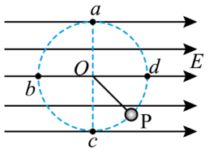

**题目**

如图所示，将绝缘细线的一端 'O' 点固定，另一端拴一带电的小球 'P'，空间存在着方向水平向右的匀强电场 'E'。刚开始小球静止于 'P' 处，与竖直方向的夹角为 '45°'，给小球一个沿圆弧切线左下方的瞬时速度，让小球在竖直平面内做半径为 'r' 的圆周运动，下列分析正确的是（　　）

A. 小球可能带负电

B. 小球在右半圈从 'd' 运动到 'c' 的过程中其速度先减小后增大

C. 当小球运动到最高点 'a' 的速度 'v ≥ √(gr)' 时，小球才能做完整的圆周运动

D. 当小球运动到最高点 'a' 时，小球的电势能与动能之和最小

**答案：D**

（图中：'a' 为圆周最高点，'c' 为最低点，'b' 在左侧，'d' 在右侧，'P' 在右下方与竖直方向成 '45°' 处）

---

#### 【讲解设计】

**第一步：由初始平衡位置判断电性和电场力大小。**

小球静止在 'P' 处时，绳沿 'OP' 方向，只有三个力：重力、绳拉力、电场力。

三力平衡 ⟹ 重力与电场力的**合力必须沿 'OP' 方向**（右下 '45°'，指向圆外），才能与绳的拉力（沿 'PO' 指向圆心）平衡。

重力竖直向下，要合成出右下 '45°' 的方向，电场力必须**水平向右**，且大小与重力相等：

'F电 = mg'

'F等效 = √((mg)² + (mg)²) = √2·mg'

电场方向水平向右，电场力与电场同向 ⟹ 小球带**正电**。**A 错。**

> **教学关键：** "静止时绳的方向"是一个免费的信息——它直接告诉你等效重力的方向。这类题第一步永远是从初始静止位置读出等效重力。

**第二步：建立等效重力模型。**（在图上画出等效重力方向）

'F等效 = √2·mg'，方向：右下 '45°'（即沿 'OP'）

于是：

- **等效最低点 = 'P' 点**（等效重力指向的那一侧），速度最大
- **等效最高点 = 'P' 的正对面 = 弧 'ab' 的中点**（左上 '45°' 方向），速度最小

**第三步：判断 B（从 'd' 到 'c'）。**

'd' 在正右方，'c' 在正下方，而等效最低点 'P' 在右下 '45°'——**正好在 'd' 和 'c' 的中间**。

所以小球从 'd' 运动到 'c'：先靠近等效最低点（等效重力做正功，速度**增大**），过了 'P' 之后远离（做负功，速度**减小**）。

是**先增大后减小**，题目说"先减小后增大"。**B 错。**

> 这一问的关键就是在图上把 'P' 点相对 'd'、'c' 的位置看清楚。**画图，不要空想。**

**第四步：判断 C（完整圆周运动的临界条件）。**

临界条件发生在**等效最高点**（弧 'ab' 中点），此时绳的弹力恰为零，等效重力全部充当向心力：

'F等效 = m·v²/r'  ⟹  '√2·mg = m·v²/r'  ⟹  'v = √(√2·gr)'

但题目问的是**几何最高点 'a'** 的速度，所以还要从等效最高点算到 'a' 点。

用动能定理。取等效重力方向（右下 '45°'）为"等效竖直"方向，等效最高点到 'a' 点沿这个方向下降的距离为：

'Δ = r − r/√2 = r(1 − √2/2)'

（等效最高点在等效竖直方向上距圆心 'r'；'a' 点在正上方，其位置向量在等效竖直方向的投影是 'r/√2'。）

'F等效 · Δ = ½·m·va² − ½·m·v²'

'√2·mg · r(1 − √2/2) = ½·m·va² − ½·m·(√2·gr)'

左边 '= (√2 − 1)mgr'，整理：

'½·va² = (√2 − 1)gr + (√2/2)gr = (3√2/2 − 1)·gr'

'va = √((3√2 − 2)gr)'

所以正确的临界条件是 'va ≥ √((3√2 − 2)gr)'，而选项 C 写的是 '√(gr)'——那是**没有电场时**普通圆周运动在最高点的临界速度。**C 错。**

> **点破陷阱：** '√(gr)' 是学生最熟悉的公式，熟悉到会不假思索地选。要让他们明白：**这个公式的前提是"合外力只有重力"，本题不满足。**

**第五步：判断 D。**

绳的拉力不做功，做功的只有重力和电场力，两者都是保守力，所以：

'Ep重 + Ep电 + Ek = 常量'

移项：

'Ep电 + Ek = 常量 − Ep重'

要让 'Ep电 + Ek' **最小**，就要让 'Ep重' **最大**，即小球处在**几何最高点 'a'**。**D 正确。**

**故选 D。**

---

#### 【板书要点】

> **本题的题眼：C 和 D 考的是两件不同的事。**
>
> - **C 问"能否转完整圈"** → 看**等效最高点**（弧 'ab' 中点）
> - **D 问"重力势能最大在哪"** → 看**几何最高点**（'a' 点）
>
> 这两个点在本题里**不是同一个点**，正是命题人要考的地方。
>
> 只有当电场力为零时，等效最高点才与几何最高点重合。

---

### 第 10 题 · 匀速圆周运动

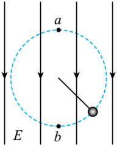

**题目**

如图所示，用绝缘细线拴住一带电荷量为 '−q'、质量为 'm' 的小球，在方向竖直向下的匀强电场中的竖直平面内做半径为 'R' 的**匀速**圆周运动。则下列说法正确的是（　　）

A. 当小球运动到最高点 'a' 时，细线的张力最小

B. 电场强度的大小为 'mg / q'

C. 因为小球做匀速圆周运动，所以机械能保持不变

D. 因为小球做匀速圆周运动，所以向心力不变

**答案：B**

---

#### 【讲解设计】

**开场提问：** "题目里哪两个字最值钱？"——**"匀速"**。整道题就靠这两个字。

**第一步：抓住"匀速"。**

匀速圆周运动意味着**合外力时刻指向圆心、大小不变**，**切向合力恒为零**。

小球受三个力：重力 'mg'（向下）、电场力、绳的拉力 'T'（沿绳指向圆心）。

拉力本身就沿半径方向，对切向没有贡献。所以要让切向合力恒为零，**重力与电场力必须相互抵消**。

> 这是一个"由运动反推受力"的逆向思维，学生不习惯。要讲清逻辑链：匀速 → 切向力为零 → 重力与电场力抵消。

**第二步：求电场强度（顺便定电性）。**

电荷量为 '−q'（负电），电场方向竖直向下 ⟹ 电场力方向竖直**向上**，正好与重力反向。平衡：

'qE = mg'  ⟹  'E = mg / q'

**B 正确。**

**第三步：判断 A（张力）。**

重力与电场力已经抵消，绳的拉力就是**唯一**的向心力：

'T = m·v² / R'

匀速 ⟹ 'v' 大小不变 ⟹ 'T' **处处相等**，不存在"最高点最小"。**A 错。**

> **对比讲解（很重要）：** 普通的竖直面圆周运动（无电场）中，'T' 在最高点最小、最低点最大。本题因为重力被抵消了，结论**完全不同**。
>
> 让学生明白：结论是从条件推出来的，条件变了结论就要重推，不能背结论。

**第四步：判断 C（机械能）。**

机械能 = 动能 + 重力势能。动能不变，但小球在竖直方向上有位移，**重力势能一直在变**，所以机械能**一直在变**。

从做功角度看：电场力做功不为零（竖直方向有位移），而"除重力外其他力做功 = 机械能变化量"，所以机械能改变。**C 错。**

**第五步：判断 D（向心力）。**

向心力是**矢量**。匀速圆周运动中向心力的**大小**不变，但方向始终指向圆心、随小球位置不断转动，所以向心力**是变化的**——这正是它能改变速度方向的原因。**D 错。**

**故选 B。**

---

#### 【板书要点】

> "匀速圆周运动"这五个字给出的信息：
>
> - 速率不变 → 动能不变
> - 切向合力为零 → 除向心力外的力必须互相抵消
> - 合力大小不变、**方向时刻变**

---

## 五、功能关系在电场中的应用

### 第 11 题 · 速度分量守恒求电势差

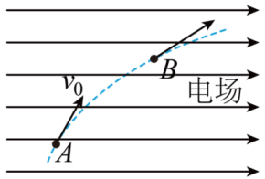

**题目**

如图所示，一质量为 'm'、电荷量为 'q'（'q > 0'）的粒子在匀强电场中运动，'A'、'B' 为其运动轨迹上的两点。已知该粒子在 'A' 点的速度大小为 'v₀'，方向与电场方向的夹角为 '60°'；它运动到 'B' 点时速度方向与电场方向的夹角为 '30°'。不计重力。'A'、'B' 两点间的电势差为（　　）

A. 'm·v₀² / (2q)'

B. 'm·v₀² / q'

C. '3m·v₀² / q'

D. '2m·v₀² / q'

**答案：B**

---

#### 【讲解设计】

**开场：** "题目只给了两个角度和一个速度，怎么把 'B' 点的速度求出来？——找那个**不变的量**。"

**第一步：识别运动模型。**

不计重力，粒子只受电场力，方向沿电场线且大小恒定 ⟹ 这是一个**类平抛运动**：沿电场方向匀加速，垂直电场方向匀速。

**关键推论（板书）：垂直于电场方向的速度分量 'vy' 始终不变。**

整道题就靠这一条。

**第二步：把 'vy' 在两点分别表示出来。**

在 'A' 点，速度 'v₀' 与电场方向成 '60°'：

'vy = v₀·sin60°'

在 'B' 点，速度 'vB' 与电场方向成 '30°'：

'vy = vB·sin30°'

> **画图辅助：** 在图上把 'A'、'B' 两点的速度都沿电场方向和垂直方向分解，让学生亲眼看到那个垂直分量是同一条线段。

**第三步：解出 'vB'。**

'v₀·sin60° = vB·sin30°'

'v₀ · (√3/2) = vB · (1/2)'  ⟹  'vB = √3·v₀'

> **合理性检验：** 夹角从 '60°' 变到 '30°'，说明粒子在沿电场方向加速，速度方向越来越贴近电场线，'vB > v₀'，符合预期。
>
> **养成习惯：算完一个结果，先问"合不合理"，再往下走。**

**第四步：从 'A' 到 'B' 用动能定理。**

电场力做的功 'W = q·U_AB'：

'q·U_AB = ½·m·vB² − ½·m·v₀²'

代入 'vB² = 3v₀²'：

'q·U_AB = ½·m·3v₀² − ½·m·v₀² = m·v₀²'

**第五步：解出电势差。**

'U_AB = m·v₀² / q'

**故选 B。**

---

#### 【板书要点】

> **通用技巧：匀强电场中不计重力的偏转问题，垂直电场方向的速度分量守恒**，这是把两个点的速度联系起来最快的桥梁。
>
> 看到"速度与电场方向成某角"这样的条件，第一反应就该是**分解出 'vy'**。

---

## 六、课堂小结（留 5 分钟带学生一起复述）

### 答案速查

| 题号 | 1 | 2 | 3 | 4 | 5 | 6 | 7 | 8 | 9 | 10 | 11 |
|---|---|---|---|---|---|---|---|---|---|---|---|
| 答案 | D | A | B | C | D | C | D | C | D | B | B |

### 五个必背结论

1. **库仑定律只对点电荷。** 遇到带电环/棒/板，改用平衡条件 + 'E = F/q'。（第 1 题）
2. **轨迹判据。** 初速度为零 + 恒力 → 直线；初速度与合力不共线 → 曲线，且轨迹夹在两方向之间。（第 3、4 题）
3. **加速—偏转两大结论。** 'y = UL²/(4U₀d)'，'tanα = UL/(2U₀d) = 2y/L'，反向延长线过板长中点。（第 6、7 题）
4. **等效重力法。** 等效最高点管"能否转完整圈"，几何最高点管"重力势能最大"，两者一般不重合。（第 9 题）
5. **垂直电场方向速度分量守恒。**（第 11 题）

### 三句功能关系口诀

> **合力做功 → 管动能**
>
> **电场力做功 → 管电势能**（'W电 = −ΔEp电'）
>
> **除重力外的力做功 → 管机械能**（重力做功永远不出现在这个式子里）

### 本节课最高频的三个错误

| 错误 | 出处 | 纠正 |
|---|---|---|
| 对有尺寸的带电体套库仑定律 | 第 1 题 B、C | 看到"环""棒""板"就换路线 |
| 把"合力做功"当成"机械能增量" | 第 4 题 D | 重力做功不改变机械能 |
| 直接套 'v ≥ √(gr)' | 第 9 题 C | 该公式前提是"合外力只有重力" |

### 作业布置建议

- **必做：** 重做第 1、6、9 三题，要求写出完整推导过程，不看答案。
- **选做：** 第 7 题中，若把"同一加速电场"改成"四种核初速度相同"，四项结论各自如何变化？
- **预习：** 专题9 带电粒子在电场中的运动2。
