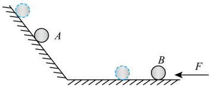
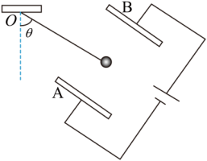
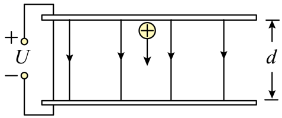
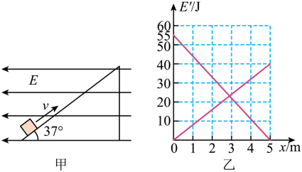
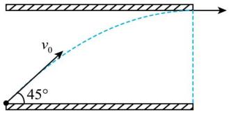
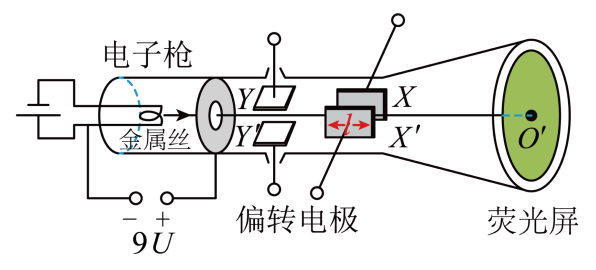
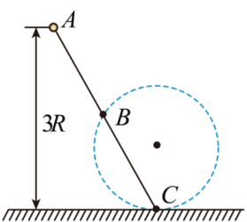
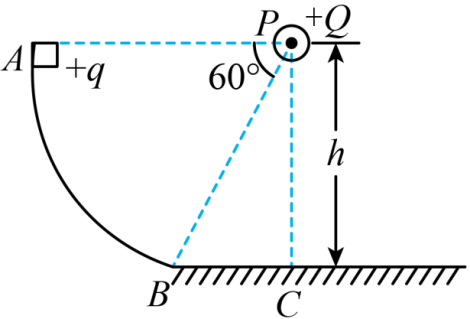
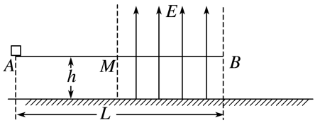

# 专题9 带电粒子在电场中的运动2 · 上课稿

## 〇、备课提示（教师自用，不板书）

**与上一讲的关系：** 上一讲是单选、以"判断"为主；这一讲是**多选 + 计算**，要求把结论**算出来**。难度台阶主要在两处——动态平衡的图解法，和点电荷等势面带来的"电场力不做功"技巧。

**本专题六个板块：**

| 板块 | 题号 | 题型 | 核心工具 |
|---|---|---|---|
| 一、动态平衡 | 1 | 多选 | 矢量三角形图解法 + 整体法 |
| 二、电容器中的平衡与动态 | 2、3 | 多选 | '电场力 ⊥ 细线'；'U' 不变还是 'Q' 不变 |
| 三、图像信息题 | 4 | 多选 | 先辨线，再挑特殊点 |
| 四、类斜抛与偏转 | 5、6 | 多选 | 垂直方向位移 '∝ v_y²'；'x < d' |
| 五、点电荷等势面 | 7、8 | 计算 | 同一等势面上电场力做功为零 |
| 六、电场力改变正压力 | 9 | 计算 | 'f = μN'，而 'N ≠ mg' |

**本节课要反复强调的三条主线：**

1. **图解法处理动态平衡。** 三力平衡里有两个力方向固定，就画矢量三角形，让第三条边转，看另两条边怎么变。
2. **等势面是白送的条件。** 点电荷的等势面是同心球面；同一球面上两点之间，电场力做功恒为零。看到"圆心处有点电荷 + 圆周上取两点"，立刻用它。
3. **摩擦力算 'N'，不算 'mg'。** 竖直方向只要多了一个力，正压力就必须重新解。

**课堂节奏建议：** 第 1、5、7 三题是"讲透题"，各留 10—12 分钟；第 3 题快速过（纯比例推理）；计算题第 8、9 题留时间让学生动笔，再讲评。

**多选题的应试提醒（第一节课开头就说）：** 多选题必须**逐项独立判断**，不能靠"选两个就够了"收工。本专题 6 道多选里，答案有 2 个的 4 道、3 个的 2 道。

---

## 一、动态平衡问题

### 【导入语】

先看一道"没有数字"的题。整道题不需要算出任何一个具体的力，只需要判断每个力是变大还是变小。这类题叫**动态平衡**，是电场与力学结合的经典考法。

**先把方法框写在黑板上：**

> **动态平衡三步走：**
>
> 1. 找出三个力，看清楚哪些的**方向固定**、哪些的方向会变
> 2. 画**封闭矢量三角形**（三力平衡 ⟺ 首尾相接成三角形）
> 3. 让方向可变的那条边转动，观察另外两条边的长短变化

---

### 第 1 题 · 斜面 + 水平面上的两个带电球【重点讲透】

**题目**

如图所示，两个带电小球 'A'、'B' 分别处在光滑绝缘的斜面和水平面上，且在同一竖直平面内。用水平向左的推力 'F' 作用于 'B' 球，两球在图示位置静止。现将 'B' 球水平向左移动一小段距离，发现 'A' 球随之沿斜面向上移动少许，两球在虚线位置重新平衡。与移动前相比，下列说法正确的是（　　）

A. 斜面对 'A' 的弹力增大

B. 水平面对 'B' 的弹力增大

C. 推力 'F' 变小

D. 两球之间的距离变小

**答案：BC**

---

#### 【讲解设计】

**开场：** "这题一个数字都没有，四个选项全是"变大变小"。谁想硬算？——算不了，因为电荷量、角度、质量全是未知的。这类题只能用**图解法**。"

**第一步：先看 'A' 球，画矢量三角形。**（板书：一定要真的画出来）

'A' 球受三个力：

- 重力 'm_A·g'：竖直向下，**大小方向都不变**
- 斜面支持力 'N_A'：垂直斜面，**方向不变**、大小可变
- 'B' 对它的库仑斥力 'F库'：沿 'BA' 连线，**方向和大小都可变**

三力平衡 ⟹ 三个力首尾相接构成**封闭三角形**。

> **画图要领（一定要让学生跟着画）：**
>
> - 重力这条边：长度和方向都锁死，是三角形的"基准边"
> - 'N_A' 这条边：方向锁死（垂直斜面），长度可变
> - 'F库' 这条边：方向、长度都可变，是唯一自由的边

**第二步：判断 'A' 球移动后三角形怎么变。**

'A' 球沿斜面**上移**后，'A' 相对 'B' 变高了 ⟹ 连线 'BA' 与水平方向的夹角**变大** ⟹ 'F库' 转得更"竖"了。

在三角形里让 'F库' 这条边转向更竖直的方向，会看到 'N_A' 和 'F库' 两条边**同时变短**。

所以：

> 'N_A' 减小，'F库' 减小

**A 错。**（斜面对 'A' 的弹力是减小的）

**第三步：判断 'N_B'——对 'A'、'B' 取整体。**

> **这一步是本题最漂亮的地方，一定要点出来。**

把 'A'、'B' 看成一个系统，库仑力成了**内力**，直接消掉。系统在竖直方向受：两球总重力（向下）、'N_A' 的竖直分量、'N_B'（竖直向上）。

竖直方向平衡：

'N_B + N_A·cosθ = (m_A + m_B)·g'

（'θ' 为斜面倾角，'N_A' 垂直斜面，其竖直分量为 'N_A·cosθ'。）

右边是常量；第一步已得 'N_A' 减小 ⟹ 'N_A·cosθ' 减小 ⟹ 'N_B' **增大**。**B 正确。**

> **整体法的价值：** 单独分析 'B' 球，'N_B' 会牵扯到库仑力的两个分量（大小和角度都在变），根本判断不了；取整体一步就出来了。
>
> **口诀：内力消不掉的时候用隔离，内力碍事的时候用整体。**

**第四步：判断推力 'F'——回到 'B' 球的水平方向。**

'B' 球在水平面上，水平方向受两个力：推力 'F'（向左）、'A' 对它的库仑斥力的水平分量（向右）。平衡：

'F = F库·cosα'

其中 'α' 是连线 'AB' 与水平方向的夹角。

第一步已经得到两个结论：

- 'F库' **减小**
- 连线变陡，即 'α' **变大** ⟹ 'cosα' **减小**

两个因子同时减小 ⟹ 乘积 'F' 一定**减小**。**C 正确。**

> 提醒学生：如果两个因子一增一减，就不能这么判断了，必须另找方法。本题运气好——两个都减小。

**第五步：判断距离。**

由第一步，'F库' 减小。库仑定律：

'F库 = kQ_A·Q_B/r²'

两球电荷量不变，'F库' 减小 ⟹ 'r' **变大**。**D 错。**

**故选 BC。**

---

#### 【板书要点】

> **本题四个选项的逻辑链，全部挂在第一步的图解结论上：**
>
> 'N_A ↓'、'F库 ↓'、'α ↑'
>
> - A 用 'N_A ↓' → 错
> - B 用 'N_A ↓' + 整体法 → 对
> - C 用 'F库 ↓' + 'cosα ↓' → 对
> - D 用 'F库 ↓' + 库仑定律 → 错
>
> **所以第一步的三角形一定要画对、画大。图画错，后面全错。**

#### 【课堂追问】

"如果 'B' 球是向右移动（远离斜面），四个选项分别怎么变？"——让学生把三角形反过来转一遍，检验是否真的掌握了图解法，而不是背结论。

---

## 二、电容器中的平衡与动态分析

### 【过渡语】

平行板电容器是本章最重要的装置。有两件事必须在做题前先问清楚：

**板书两条判据（整节课不擦）：**

> **电容器动态分析的第一问：电源接着还是断开？**
>
> - **始终连接电源** ⟹ **电压 'U' 不变**，'E = U/d'，改变 'd' 就改变 'E'
> - **充电后断开电源** ⟹ **电荷量 'Q' 不变**，'E = U/d = Q/(εS)'，改变 'd' 时 'E' 反而不变

---

### 第 2 题 · 倾斜极板间的悬挂小球

**题目**

如图所示，一轻质绝缘细线一端固定在 'O' 点，另一端系一带电量大小为 'q'、质量为 'm' 的小球，小球静止悬挂放置在正对距离为 'd' 的平行板电容器 'A'、'B' 间，电容器极板足够大，电容器两板连接在电源两端，细线与竖直方向夹角 'θ = 60°'，细线、小球在竖直纸面内，'A'、'B' 两板平行正对倾斜放置、且与纸面垂直、与细线平行。已知重力加速度为 'g'，下列说法正确的有（　　）

A. 小球带正电

B. 两极板的电势差 'U = √3·mgd/(2q)'

C. 若在竖直面内保持两板正对面积不变，'B' 板向 'A' 板缓慢靠近，则小球将缓慢上移

D. 若绳子突然断开，则小球做曲线运动

**答案：BC**

---

#### 【讲解设计】

**开场：** "这题的图看起来很乱——极板是斜的、绳也是斜的。但题目里有一句话是白送的，找出来这题就简单了。"

**第零步：把几何关系理清楚——本题的关键。**

题目说"**两板与细线平行**"。极板间的电场**垂直于板面**，而板面平行于细线，所以：

> '电场力 ⊥ 细线'

**在图上把这个直角标出来。** 这个垂直关系让后面的受力分析变得非常简单。

**第一步：判断电性。**

小球受三个力：重力 'mg'、绳的拉力 'F'（沿绳指向 'O'）、电场力 'F电'。三力平衡。

由图，'B' 板接电源正极带正电，电场方向由 'B' 指向 'A'。要让三力平衡，电场力必须指向 'B' 板一侧——也就是与电场方向**相反**。正电荷受力与电场同向，所以小球必带**负电**。**A 错。**

**第二步：用平衡条件求电场力。**

以竖直、水平方向分解（'θ = 60°'，绳与竖直成 '60°'，电场力与绳垂直）：

'F·sinθ = F电·cosθ'

'F·cosθ + F电·sinθ = mg'

由第一式：'F电 = F·tanθ = √3·F'。代入第二式：

'F·(1/2) + √3·F·(√3/2) = mg'  ⟹  '2F = mg'  ⟹  'F = mg/2'

'F电 = √3·F = √3·mg/2'

> **更快的做法（提一句就好）：** 因为电场力与绳垂直，重力就是这个直角三角形的斜边，直接分解重力：沿绳方向的分量被拉力平衡，垂直绳方向的分量被电场力平衡，于是 'F电 = mg·sin60° = √3·mg/2'，一步到位。

**第三步：由电场力求电势差。**

'E_AB = F电/q = √3·mg/(2q)'

两板正对距离为 'd'，匀强电场中：

'U = E_AB·d = √3·mgd/(2q)'

**B 正确。**

**第四步：判断 C——'B' 板靠近 'A' 板会怎样。**

> **先问那句判据：电源接着还是断开？** 题目说"电容器两板连接在电源两端" ⟹ **电压 'U' 保持不变**。

'd ↓'  ⟹  'E = U/d ↑'  ⟹  'F电 = qE ↑'

电场力的**方向不变**（板面朝向没变），只是变大；重力也不变。

重力与电场力的合力必须与绳拉力等大反向。初始时电场力恰好垂直于绳，现在电场力沿原方向变大，合力方向会向电场力那一侧偏转，也就是绳被拉得更"立"起来——绳与竖直方向的夹角减小，小球沿圆弧**缓慢上移**。**C 正确。**

**第五步：判断 D——绳断后的运动。**

绳断瞬间，小球只剩重力和电场力，两个都是**恒力**，合力恒定；而小球此刻的速度为 '0'。

初速度为零 + 合力恒定 ⟹ 沿合力方向做**匀加速直线运动**（方向正是原来绳拉力的反方向），不是曲线运动。**D 错。**

**故选 BC。**

---

#### 【板书要点】

> 判断曲线还是直线，永远只看一条：**初速度方向与合力方向是否共线。**
>
> **初速度为零 ⟹ 一定是直线。** 这条上一讲讲过，这一讲又考了一次，说明是高频点。

---

### 第 3 题 · 平行板中的比例推理

**题目**

如图所示，平行板电容器极板间距为 'd'，所加电压为 'U'，极板间形成匀强电场。一个带正电的粒子从上极板由静止释放，经过时间 't' 后到达下极板，在此过程中电场力做功为 'W'。忽略重力影响，下列说法正确的有（　　）

A. 若仅将 'd' 增大一倍，则 'W' 将保持不变

B. 若仅将 'd' 增大一倍，则 't' 将增大一倍

C. 若仅将 'U' 增大一倍，则 't' 将减小一半

D. 若仅将 'U' 增大一倍，则 'W' 将增大一倍

**答案：ABD**

---

#### 【讲解设计】

**开场：** "这题不用画图，也不用受力分析。把两个公式写出来，四个选项直接代进去比。**先建立函数关系，再看比例**——这是所有"仅改变某个量"题型的通法。"

**第零步：把两个公式准备好。**

**功**（粒子走完全程，两端电势差就是 'U'）：

'W = qU'

**时间**（初速度为零的匀加速，位移为 'd'，加速度 'a = qE/m = qU/(md)'）：

'd = ½·a·t²'  ⟹  't = √(2d/a) = d·√(2m/(qU))'

把 't' 化成只含 'd'、'U' 的形式后，比例关系一眼可见：

> **两条关系（框起来）：**
>
> 'W ∝ U'（与 'd' 无关）
>
> 't ∝ d/√U'

**第一步：A——只把 'd' 变成 '2d'。**

'W = qU' 里根本没有 'd'。虽然场强 'E = U/d' 减半了，但粒子走过的距离翻倍，两个变化正好抵消，做功不变。**A 正确。**

> **物理意义（要讲）：** 电场力做功只取决于电荷量和**电势差**，与路径长短、场强大小无关。这是电场力做功与重力做功的共同特点——都是保守力。

**第二步：B——只把 'd' 变成 '2d'，看时间。**

由 't ∝ d/√U'，'U' 不变、'd' 翻倍 ⟹ 't' 翻倍。**B 正确。**

也可以分步看：'E' 减半 ⟹ 'a' 减半；位移翻倍。't = √(2d/a)' 中分子翻倍、分母减半，根号内变成 '4' 倍，'t' 变成 '2' 倍。

**第三步：C——只把 'U' 变成 '2U'，看时间。**

由 't ∝ d/√U'，'d' 不变、'U' 翻倍 ⟹

't′ = t/√2 = (√2/2)·t ≈ 0.71·t'

是变成原来的 '√2/2'，**不是**减小一半。**C 错。**

> **本题唯一的坑，一定要点破：** 加速度变成 '2' 倍，时间并不是变成一半。
>
> **位移一定时，'t ∝ 1/√a'，不是 '1/a'。**

**第四步：D——只把 'U' 变成 '2U'，看做功。**

'W = qU'，电荷量不变，'U' 翻倍 ⟹ 'W' 翻倍。**D 正确。**

**故选 ABD。**

---

#### 【板书要点】

> **"仅改变某个量"型题目的通法：**
>
> 1. 把待判断的物理量写成**只含自变量的表达式**（把中间量全部消掉）
> 2. 读出比例关系
> 3. 代入倍数
>
> 本题的中间量是 'a' 和 'E'，一定要消干净，否则很容易顾此失彼。

---

## 三、图像信息题

### 第 4 题 · 电势能—动能双曲线图

**题目**

如图甲所示，水平面上固定一倾角为 '37°' 的光滑绝缘斜面，空间存在水平向左的匀强电场。一带电量 'q = 4×10⁻⁵ C' 的小物块从斜面底端以一定初速度沿斜面上滑，图乙是在上滑过程中物块的电势能、动能分别随位移 'x' 变化的关系。已知重力加速度 'g = 10 m/s²'，则物块质量 'm' 和电场强度 'E' 的大小分别为（　　）

A. 'm = 0.5 kg'

B. 'm = 0.3 kg'

C. 'E = 2×10⁵ N/C'

D. 'E = 2.5×10⁵ N/C'

**答案：AD**

---

#### 【讲解设计】

**开场提问：** "图乙里两条直线交叉在一起。谁能告诉我哪条是动能、哪条是电势能？"——先让学生答，答错正好讲。

**第零步：辨线——本题的第一道关口。**

物块沿斜面向上运动时：

- **动能在减小** ⟹ 从 '55 J' 降到 '0' 的那条是**动能**
- **电势能在增加**（电场水平向左，物块向右上运动，电场力做负功）⟹ 从 '0' 升到 '40 J' 的那条是**电势能**

> **辨线的依据永远是物理，不是图形。** 先想"这个量应该增还是减"，再去图上找对应的线。

取全程终点 'x = 5 m' 这一个位置，可以读出三条信息：

'E_k = 0'，'E_p = 40 J'，'E_k0 = 55 J'

> **为什么挑 'x = 5 m'？** 因为那里动能为零，方程最干净。**图像题永远挑信息最全、数值最特殊的那个点。**

**第一步：由电势能的变化求 'E'。**

电势能的增加量等于电场力做的负功的绝对值：

'|W电| = E_p − 0 = 40 J'

物块沿斜面走了 'x = 5 m'，电场力**水平**，所以只有**水平位移**参与做功：

'|W电| = qE·x·cos37°'

> **这是本题第二道关口。** 位移沿斜面、力沿水平，必须投影。很多学生直接写 'qE·x'，少乘一个 'cos37°'。

代入数字（'cos37° = 0.8'）：

'40 = 4×10⁻⁵ × E × 5 × 0.8'

'40 = 1.6×10⁻⁴·E'  ⟹  'E = 2.5×10⁵ N/C'

**D 正确，C 错。**

**第二步：对全程用动能定理求 'm'。**

从底端到 'x = 5 m'（速度恰好为零），做功的有电场力和重力（斜面光滑，支持力不做功）：

'−qEx·cos37° − mgx·sin37° = E_k − E_k0 = 0 − 55'

第一步已经算出 'qEx·cos37° = 40 J'，代入（'sin37° = 0.6'）：

'−40 − m × 10 × 5 × 0.6 = −55'

'−40 − 30m = −55'  ⟹  '30m = 15'  ⟹  'm = 0.5 kg'

**A 正确，B 错。**

**故选 AD。**

---

#### 【板书要点】

> **图像题的通用起手式：**
>
> 1. **先分清每条线代表什么**——看这个物理量该增还是该减
> 2. **再挑一个信息最全的特殊点**代入方程
> 3. 注意**力与位移方向不一致时要投影**
>
> 本题两次用到 '37°'：'cos37° = 0.8' 管电场力做功，'sin37° = 0.6' 管重力做功。别记混。

---

## 四、类斜抛与偏转

### 【过渡语】

回到偏转模型，但这一讲的两道题都比上一讲深一层：第 5 题考的是**改变初速度后轨迹怎么变**，第 6 题考的是**动能到底等不等于 'qU加 + qU偏'**。

---

### 第 5 题 · 斜射入电容器【重点讲透】

**题目**

如图所示，水平放置的平行板电容器，极板间所加电压为 'U'。带电粒子紧靠下极板边缘以初速度 'v₀' 射入极板，入射时速度方向与极板夹角为 '45°'，粒子运动轨迹的最高点恰好在上极板边缘，忽略边缘效应，不计粒子重力。下列说法正确的是（　　）

A. 粒子的电荷量 'q' 与质量 'm' 之比为 'q/m = v₀²/(4U)'

B. 粒子的电荷量 'q' 与质量 'm' 之比为 'q/m = 3v₀²/(4U)'

C. 保持入射方向不变，仅将粒子初速度大小变为原来的 '1/2'，粒子将打在下极板上

D. 保持入射方向不变，仅将粒子初速度大小变为原来的 '1/2'，粒子仍从极板之间飞出

**答案：AC**

---

#### 【讲解设计】

**第零步：识别模型。**

不计重力，只有垂直于板面的电场力，且电场力与初速度成 '45°'——这就是一个标准的**斜上抛**模型：

- 沿板方向：**匀速**
- 垂直板方向：**匀减速**（先上升、后下落）

分解初速度：

'v_x = v₀·cos45° = (√2/2)·v₀'（沿板，不变）

'v_y = v₀·sin45° = (√2/2)·v₀'（垂直板，会减到零）

> **在图上把 'v₀' 分解画出来。** 后面每一步都要用到这两个分量。

**第一步：由"最高点恰在上极板边缘"求比荷。**

"轨迹最高点恰好在上极板"意味着粒子从下极板一直升到上极板，垂直方向的速度恰好减为零，同时**跨越了整个板间电压 'U'**。

对垂直方向用动能定理（电场力做负功）：

'−qU = 0 − ½·m·v_y²'

'qU = ½·m·((√2/2)·v₀)² = ½·m·(v₀²/2) = m·v₀²/4'

'q/m = v₀²/(4U)'

**A 正确，B 错。**

> **这里最容易错的地方：只能用 'v_y'，不能用 'v₀'。**
>
> 沿板方向的速度分量不受电场力影响，从头到尾没变，与这个能量过程完全无关。

**第二步：初速度减半后，先看它还能不能碰到上极板。**

入射方向不变（仍是 '45°'），初速度变为 'v₀/2'，则：

'v_y′ = v_y/2'

垂直方向的最大位移 '∝ v_y²'，现在 'v_y' 减半 ⟹ 最大位移变成原来的 '1/4'，远达不到上极板。

所以粒子会**升到某个高度后落回下极板**——但还不能立刻下结论，得看它在落回来之前会不会已经飞出极板右端。

**第三步：比较水平射程。**

设加速度大小为 'a'（'U' 和 'd' 都没变，所以 'a' 不变）。

**原来的情况：** 垂直速度 'v_y' 减到零用时 't₁ = v_y/a'，此时粒子恰好到达极板右端，所以极板长度：

'L = v_x·t₁ = (√2/2)·v₀·t₁'

**新的情况：** 'v_y′ = v_y/2'，上升到最高点用时：

't₂ = v_y′/a = t₁/2'

由斜抛的对称性，从射入到落回下极板的总时间是 '2t₂ = t₁'。这段时间内的水平位移：

'L′ = v_x′·2t₂ = (√2/4)·v₀·t₁'

比较两者：

'L′/L = 1/2'  ⟹  'L′ = L/2 < L'

粒子在只走了半个极板长度时就落回了下极板。**C 正确，D 错。**

**故选 AC。**

---

#### 【板书要点】

> **直觉陷阱（本题的核心考点）：**
>
> 很多同学以为"速度小了，飞得近，所以更容易从板间飞出"。**恰恰相反。**
>
> - 垂直方向的位移按 **平方** 缩小（'∝ v_y²'）
> - 水平射程按 **一次方** 缩小（'∝ v_x'）
>
> 结果是粒子还没飞出去就先落回来了。
>
> **凡是"改变初速度"的偏转题，都要把两个方向的缩放倍数分别算清楚，再比较。**

---

### 第 6 题 · 示波管

**题目**

如图所示，示波管由电子枪、竖直方向偏转电极 'YY′'、水平方向偏转电极 'XX′' 和荧光屏组成。电极 'XX′' 的长度为 'l'、间距为 'd'、极板间电压为 'U'，'YY′' 极板间电压为零，电子枪加速电压为 '9U'。电子刚离开金属丝的速度为零，从电子枪射出后沿 'OO′' 方向进入偏转电极。已知电子电荷量为 'e'，质量为 'm'，则电子（　　）

A. 在 'XX′' 极板间的加速度大小为 'eU/(md)'

B. 打在荧光屏时，动能大小为 '10eU'

C. 在 'XX′' 极板间运动的时间为 'l·√(m/(18eU))'

D. 打在荧光屏时，其速度方向与 'OO′' 连线夹角 'α' 的正切 'tanα = l/(18d)'

**答案：ACD**

---

#### 【讲解设计】

**开场：** "这是上一讲加速—偏转模型的应用题，四个选项里只有一个错。先把入射速度算出来，后面三个都要用。"

**第零步：算入射速度。**

电子在电子枪里由静止经 '9U' 加速：

'e·9U = ½·m·v₀²'  ⟹  'v₀ = √(18eU/m)'

**第一步：判断 A（偏转极板间的加速度）。**

'XX′' 间是匀强电场，'E = U/d'，由牛顿第二定律：

'a_x = eE/m = eU/(md)'

**A 正确。**

**第二步：判断 C（在极板间的时间）。**

沿 'OO′' 方向（即入射方向）不受力，做匀速运动，走完板长 'l'：

't = l/v₀ = l·√(m/(18eU))'

**C 正确。**

**第三步：判断 D（打屏时的速度方向）。**

离开 'XX′' 时，垂直方向获得的分速度：

'v_x = a_x·t = (eU/(md))·l·√(m/(18eU)) = (l/d)·√(eU/(18m))'

离开偏转电场后电子做匀速直线运动，速度方向不再改变，所以打屏时的夹角就是出射角：

'tanα = v_x/v₀ = (l/d)·(1/18) = l/(18d)'

**D 正确。**

> **更快的做法（一定要提）：** 直接套上一讲推好的通用结论：
>
> 'tanα = U偏·l/(2·U加·d) = Ul/(2·9U·d) = l/(18d)'
>
> 一步到位。这就是上一讲要求背结论的价值。

**第四步：判断 B（打屏时的动能）——本题唯一的错项。**

全程用动能定理，加速电场做功 'e·9U'，偏转电场做功 'e·(U/d)·x'，其中 'x' 是电子在偏转电场里沿电场方向的位移：

'½·m·v² = e·9U + e·(U/d)·x'

关键在于 'x' 的大小。电子必须从极板间飞出去（打不到极板），所以：

'x < d'  ⟹  'e·(U/d)·x < eU'

'½·m·v² < 9eU + eU = 10eU'

动能**小于** '10eU'，而不是等于。**B 错。**

**故选 ACD。**

---

#### 【板书要点】

> **B 项的陷阱与上一讲第 6 题的 B 项是同一个：** 默认粒子"走完了整个板间距 'd'"。
>
> 实际上偏转位移只有 'd' 的一小部分（否则粒子早就撞到极板上了）。
>
> **凡是看到 'qU加 + qU偏' 这种形式的动能表达式，都要先问一句：粒子真的跨越了整个偏转电压吗？** 答案几乎总是"没有"。

---

## 五、计算题：点电荷的等势面

### 【过渡语】

后面三道是计算题，要动笔写过程。第 7、8 两题共用一个核心技巧，先把它写在黑板上：

**板书方法框：**

> **点电荷等势面技巧：**
>
> 点电荷的等势面是**以它为球心的同心球面**。
>
> ⟹ 到点电荷**距离相等**的两点，电势相同
>
> ⟹ 这两点之间，**电场力做功为零**
>
> **识别信号：** "圆心处有一个点电荷" + "圆周上取两点"。看到就用。

---

### 第 7 题 · 直杆与圆周【重点讲透】

**题目**

如图所示，在竖直平面内，光滑绝缘直杆 'AC' 与半径为 'R' 的圆周交于 'B'、'C' 两点，在圆心处有一固定的正点电荷，'B' 点为 'AC' 的中点，'C' 点位于圆周的最低点。现有一质量为 'm'、电荷量为 '−q'、套在杆上的带负电小球（可视为质点）从 'A' 点由静止开始沿杆下滑。已知重力加速度为 'g'，'A' 点距过 'C' 点的水平面的竖直高度为 '3R'，小球滑到 'B' 点时的速度大小为 '2·√(gR)'。（取过 'C' 点的水平面为零势能面。）求：

(1) 小球滑到 'B' 点时的机械能大小；

(2) 小球滑到 'C' 点时的速度大小；

(3) 若以 'C' 点作为参考点（零电势点），试确定 'A' 点的电势。

**答案：**(1) '7mgR/2'　(2) '√(7gR)'　(3) '−mgR/(2q)'

---

#### 【讲解设计】

**第零步：先找题眼——'B'、'C' 在同一等势面上。**

圆心处有一个点电荷，等势面是同心球面。'B'、'C' 都在半径为 'R' 的圆周上，到圆心距离都是 'R'，所以：

'φ_B = φ_C'

**这意味着小球从 'B' 运动到 'C' 的过程中，电场力做功为零。** 第 (2) 问就靠这一条。

> **让学生先找题眼再动笔。** 如果没看出这一点，第 (2) 问会卡在"库仑力大小随位置变化，功没法算"上——那是死路。

**第一步：(1) 求 'B' 点的机械能。**

先算 'B' 点的高度。'B' 是 'AC' 的中点，'A' 高 '3R'、'C' 高 '0'，所以：

'h_B = (3R + 0)/2 = 3R/2'

机械能 = 重力势能 + 动能（零势能面取在过 'C' 的水平面）：

'E_B = mg·h_B + ½·m·v_B² = mg·(3R/2) + ½·m·(2·√(gR))²'

'E_B = (3/2)·mgR + ½·m·4gR = (3/2)·mgR + 2mgR = (7/2)·mgR'

**第二步：(2) 求 'C' 点速度——用 'B → C' 这一段。**

> **为什么选 'B → C' 而不是 'A → C'？** 因为这一段电场力不做功（第零步）。**选段的依据是"哪一段的未知量最少"。**

杆光滑、弹力垂直于运动方向也不做功，所以只有重力做功。'B' 到 'C' 的高度差：

'h_BC = 3R/2 − 0 = 3R/2'

动能定理：

'mg·(3R/2) = ½·m·v_C² − ½·m·v_B²'

'½·m·v_C² = (3/2)·mgR + ½·m·4gR = (7/2)·mgR'

'v_C² = 7gR'  ⟹  'v_C = √(7gR)'

> **更简洁的说法：** 'B → C' 只有重力做功 ⟹ **机械能守恒**，'C' 点机械能仍是 '7mgR/2'；而 'C' 点高度为零，机械能全部是动能，直接得 'v_C = √(7gR)'。
>
> 第 (1) 问的答案在第 (2) 问里直接复用了——这是命题人设计的递进结构。

**第三步：(3) 求 'A' 点电势——改用 'A → C' 全程。**

这一段电场力**要做功**（'A' 不在那个等势面上），正是我们要求的量。

对 'A → C' 用动能定理（'A' 点由静止出发，下落总高度 '3R'）：

'mg·3R + W电 = ½·m·v_C² − 0 = (7/2)·mgR'

'W电 = (7/2)·mgR − 3mgR = ½·mgR'

**第四步：把功换算成电势——注意电荷是负的。**

电场力做功与电势差的关系：

'W电 = Q·U_AC = Q·(φ_A − φ_C)'

> **这里的 'Q' 要带符号代入！** 小球电荷量是 '−q'，不是 'q'。这是本题最后一个失分点。

又题设 'φ_C = 0'：

'½·mgR = (−q)·(φ_A − 0) = −q·φ_A'

'φ_A = −mgR/(2q)'

**第五步：检查符号是否合理。**（一定要带学生做这一步）

圆心处是**正**点电荷，离它越远电势越低。'A' 在圆周外侧（比 'B'、'C' 离圆心更远），而 'φ_B = φ_C = 0'，所以 'φ_A' 应当为**负值**——与算出的 '−mgR/(2q)' 一致。

---

#### 【板书要点】

> **本题三问层层递进，是电场能量问题的标准三步走：**
>
> 1. **(1) 机械能的定义**——纯计算
> 2. **(2) 用"等势面上电场力不做功"**绕开未知的电场力
> 3. **(3) 用全程动能定理把电场力做功"反解"出来**，再换算成电势
>
> **算完一定检查符号。** 正点电荷附近，越近电势越高。

---

### 第 8 题 · 弧形轨道 + 圆心点电荷

**题目**

如图所示，竖直平面内固定一个圆心角为 '60°' 的弧形光滑轨道 'AB'，'P' 为圆心，半径 'AP' 水平。在圆心 'P' 处固定一电荷量为 '+Q' 的点电荷，将质量为 'm'、电荷量为 '+q' 的小物块（可视为质点）从 'A' 点由静止释放恰好能滑至光滑水平地面的 'C' 点，'C' 为 'P' 正下方的点且 'PC' 相距 'h'，不计物块在 'B' 点滑上水平面时的能量损失。若令 'A' 点电势为 'φ'，静电力常量为 'k'，重力加速度为 'g'。求：

(1) 小物块滑至圆弧轨道 'B' 点时对轨道的压力大小；

(2) 'C' 点的电势。

**答案：**(1) '3√3·mg/2 + 3kqQ/(4h²)'　(2) 'φ + mgh/q'

---

#### 【讲解设计】

**开场：** "又是圆心处放点电荷。第一件事做什么？——找等势面。'A'、'B' 都在圆周上，所以 'A → B' 电场力不做功。"

**第零步：几何关系。**（先在图上标出来）

'B' 在水平地面上，圆心 'P' 距地面 'h'。半径 'AP' 水平、圆心角 '∠APB = 60°'，所以半径 'PB' 与水平方向成 '60°'。'P' 到地面的竖直距离 'h' 就是 'PB' 的竖直分量：

'h = r·sin60°'  ⟹  'r = h/sin60° = 2h/√3'

'r² = 4h²/3'

另外，'AP' 水平意味着 'A' 与 'P' 等高，即 **'A' 点距地面也是 'h'**。

**第一步：求 'B' 点的速度。**

'A'、'B' 都在以 'P' 为圆心、半径 'r' 的圆上，处于同一等势面：

'φ_A = φ_B = φ'  ⟹  'W电(A → B) = 0'

轨道光滑，弹力不做功，所以 'A → B' 只有重力做功，下落高度为 'h'：

'mgh = ½·m·v_B²'  ⟹  'v_B² = 2gh'

**第二步：在 'B' 点列向心方程。**

> **这是本题的难点。一定要在图上把向心方向画出来。**

'B' 点做圆周运动，向心方向沿 'BP'（指向圆心 'P'，与水平方向成 '60°' 斜向上）。沿这个方向受力有三个：

- 轨道支持力 'F_N'：沿 'BP'，指向圆心，**为正**
- 重力 'mg' 的分量：重力竖直向下，与向心方向成 '150°'，投影为 '−mg·sin60°'
- 库仑斥力 'F库'：同号电荷相斥，方向由 'P' 指向 'B'，即**背离**圆心，**为负**

'F_N − mg·sin60° − F库 = m·v_B²/r'

**第三步：把各项算出来代进去。**

库仑力：

'F库 = kqQ/r² = kqQ/(4h²/3) = 3kqQ/(4h²)'

向心力项：

'm·v_B²/r = m·2gh/(2h/√3) = √3·mg'

重力分量：

'mg·sin60° = √3·mg/2'

代入：

'F_N = √3·mg + √3·mg/2 + 3kqQ/(4h²) = 3√3·mg/2 + 3kqQ/(4h²)'

**第四步：由牛顿第三定律得到对轨道的压力。**

物块对轨道的压力与轨道对物块的支持力等大反向：

'F_N′ = 3√3·mg/2 + 3kqQ/(4h²)'

> **提醒：** 题目问的是"**对轨道**的压力"，不是"轨道对物块的支持力"。虽然数值一样，但答题时要写清楚是牛顿第三定律。

**第五步：(2) 求 'C' 点电势——用 'B → C' 这一段。**

地面光滑水平，'B → C' 过程中：重力不做功（无高度变化）、支持力不做功，**只有电场力做功**。

"恰好能滑至 'C' 点"意味着到达 'C' 时速度**恰好为零**。对 'B → C' 用动能定理：

'q·U_BC = 0 − ½·m·v_B² = −mgh'

'U_BC = −mgh/q'

**第六步：由电势差求 'φ_C'。**

'U_BC = φ_B − φ_C'

由第一步 'φ_B = φ_A = φ'：

'φ_C = φ_B − U_BC = φ + mgh/q'

**第七步：检查符号。**

'P' 处是正电荷，'C' 比 'B' 离 'P' **更近**（'PC = h'，而 'PB = r = 2h/√3 ≈ 1.15h'），离正电荷越近电势越高，所以 'φ_C > φ_B'——与结果 'φ_C = φ + mgh/q > φ' 一致。

---

#### 【板书要点】

> **本题和第 7 题的骨架完全一样，可以并排讲：**
>
> | 步骤 | 第 7 题 | 第 8 题 |
> |---|---|---|
> | 找等势面 | 'B'、'C' 同圆周 | 'A'、'B' 同圆周 |
> | 用不做功的那段 | 'B → C' 求 'v_C' | 'A → B' 求 'v_B' |
> | 用做功的那段 | 'A → C' 求 'φ_A' | 'B → C' 求 'φ_C' |
>
> **两道题都是：先用"不做功"的段求速度，再用"做功"的段求电势。**

---

## 六、计算题：电场力改变正压力

### 第 9 题 · 水平轨道 + 竖直电场

**题目**

如图所示，'AMB' 是一条长 'L = 10 m' 的绝缘水平轨道，固定在离水平地面高 'h = 1.25 m' 处，'A'、'B' 为端点，'M' 为中点，轨道 'MB' 处在方向竖直向上、大小 'E = 5×10³ N/C' 的匀强电场中。一质量 'm = 0.1 kg'、电荷量 'q = +1.3×10⁻⁴ C' 的可视为质点的滑块以初速度 'v₀ = 6 m/s' 在轨道上自 'A' 点开始向右运动，经 'M' 点进入电场，从 'B' 点离开电场。已知滑块与轨道间的动摩擦因数 'μ = 0.2'，'g = 10 m/s²'。求滑块：

(1) 到达 'M' 点时的速度大小；

(2) 从 'M' 点运动到 'B' 点所用的时间；

(3) 落地点距 'B' 点的水平距离。

**答案：**(1) '4 m/s'　(2) '10/7 ≈ 1.4 s'　(3) '1.5 m'

---

#### 【讲解设计】

**开场提问：** "电场是竖直向上的，滑块是水平运动的。电场力做功吗？"——不做功。"那它有什么用？"——这就是本题的全部考点。

**第零步：把全程分成三段。**（板书表格）

| 阶段 | 区间 | 特点 |
|---|---|---|
| ① | 'A → M'（'5 m'） | 无电场，正压力 '= mg' |
| ② | 'M → B'（'5 m'） | 有竖直向上的电场力，正压力**减小** |
| ③ | 'B' 之后 | 离开轨道，**平抛** |

**第一步：(1) 'A → M' 段。**

这一段没有电场，滑块在水平轨道上，竖直方向平衡：

'N = mg = 0.1 × 10 = 1 N'

摩擦力 'f = μN = 0.2 × 1 = 0.2 N'，方向与运动方向相反，所以：

'a = −f/m = −μg = −2 m/s²'

'M' 是中点，'AM = L/2 = 5 m'。用速度位移关系：

'v_M² = v₀² + 2ax = 36 − 20 = 16'

'v_M = 4 m/s'

**第二步：(2) 'M → B' 段——先重算正压力。**

> **本题的核心考点，一定要重重地讲。**

进入电场后，滑块带正电、电场竖直向上，所以电场力**竖直向上**：

'qE = 1.3×10⁻⁴ × 5×10³ = 0.65 N'

竖直方向仍然平衡（滑块没有离开轨道），但轨道要托的力变小了：

'N′ = mg − qE = 1 − 0.65 = 0.35 N'

'f′ = μN′ = 0.2 × 0.35 = 0.07 N'

'a′ = −f′/m = −0.7 m/s²'

> **板书写大字：电场力改变的不是水平受力，而是正压力，进而改变摩擦力。**
>
> 电场力本身竖直向上，一点功都不做——但它让摩擦力从 '0.2 N' 降到了 '0.07 N'。

**第三步：算 'B' 点速度和这一段的时间。**

'v_B² = v_M² + 2a′x = 16 − 7 = 9'

'v_B = 3 m/s'

时间用速度公式最直接：

'v_B = v_M + a′t'  ⟹  '3 = 4 − 0.7t'

't = 1/0.7 = 10/7 ≈ 1.4 s'

> **校验（养成习惯）：** 用平均速度反算位移：'x = ((v_M + v_B)/2)·t = 3.5 × 10/7 = 5 m' ✓ 与题给的 '5 m' 一致。

**第四步：(3) 离开 'B' 点之后——平抛。**

滑块以 'v_B = 3 m/s' 水平飞出，之后离开了轨道也离开了电场区域，只受重力，做**平抛运动**。

竖直方向自由落体，下落高度 'h = 1.25 m'：

'h = ½·g·t′²'  ⟹  '1.25 = 5·t′²'

't′² = 0.25'  ⟹  't′ = 0.5 s'

水平方向匀速：

'x = v_B·t′ = 3 × 0.5 = 1.5 m'

**落地点距 'B' 点的水平距离为 '1.5 m'。**

---

#### 【板书要点】

> **全题的关键就一句话：**
>
> **摩擦力等于 'μN'，而 'N' 不一定等于 'mg'。**
>
> 只要竖直方向多了一个力（电场力、拉力的竖直分量、洛伦兹力……），就必须**重新列竖直方向的平衡方程求 'N'**。
>
> **反问：** 如果电场力再大一点，'qE > mg' 会怎样？——滑块会离开轨道，题目就不成立了。所以出题人一定会让 'qE < mg'。

---

## 七、课堂小结（留 8 分钟带学生一起复述）

### 答案速查

| 题号 | 1 | 2 | 3 | 4 | 5 | 6 |
|---|---|---|---|---|---|---|
| 答案 | BC | BC | ABD | AD | AC | ACD |

第 7～9 题为计算题：

| 题号 | 答案 |
|---|---|
| 7 | (1) '7mgR/2'　(2) '√(7gR)'　(3) '−mgR/(2q)' |
| 8 | (1) '3√3·mg/2 + 3kqQ/(4h²)'　(2) 'φ + mgh/q' |
| 9 | (1) '4 m/s'　(2) '10/7 s'　(3) '1.5 m' |

### 五个必记方法

1. **动态平衡用图解法。** 两个力方向固定 ⟹ 画封闭矢量三角形，让第三条边转。（第 1 题）
2. **电容器动态分析先问电源。** 接着 ⟹ 'U' 不变；断开 ⟹ 'Q' 不变。（第 2 题）
3. **"仅改变某量"先写函数式。** 消掉中间量，再读比例。注意 't ∝ 1/√a'。（第 3 题）
4. **点电荷等势面 = 同心球面。** 同一球面上两点间电场力做功为零。（第 7、8 题）
5. **'f = μN'，且 'N ≠ mg'。** 竖直方向多一个力，就重列平衡方程。（第 9 题）

### 本节课最高频的四个错误

| 错误 | 出处 | 纠正 |
|---|---|---|
| 单独隔离 'B' 球判断 'N_B' | 第 1 题 B | 库仑力碍事时用整体法 |
| 认为 'a' 翻倍则 't' 减半 | 第 3 题 C | 位移一定时 't ∝ 1/√a' |
| 力与位移不共线时漏掉投影 | 第 4 题 | 电场力做功要乘 'cos37°' |
| 动能写成 'qU加 + qU偏' | 第 6 题 B | 偏转位移 'x < d'，取不到等号 |
| 电荷量代入时漏掉负号 | 第 7 题 (3) | 'W电 = Q·U'，'Q' 带符号 |

### 与上一讲的对照（复习用）

| 主题 | 上一讲（运动1） | 本讲（运动2） |
|---|---|---|
| 平衡 | 静态三力平衡 | **动态**平衡、图解法 |
| 偏转 | 正入射，求 'y' 和 'tanα' | **斜**入射，改变 'v₀' 后的轨迹 |
| 圆周 | 等效重力法 | 圆心点电荷 + **等势面** |
| 能量 | 三句功能关系口诀 | 用功能关系**反解电势** |

### 作业布置建议

- **必做：** 重做第 1、5、7 三题，第 1 题必须画出矢量三角形，第 7 题必须写出符号检查那一步。
- **选做：** 第 9 题中，若电场改为竖直**向下**，三问的答案分别如何变化？（提示：'N' 变大，摩擦力变大，滑块可能在 'B' 点前就停下）
- **预习：** 专题10 电路及其应用。
